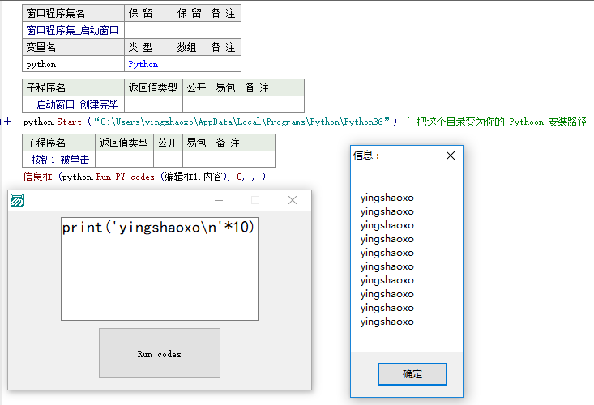

# E_Python
易语言 无缝调用 Python ， Easy Language [communicate](https://t.me/EasyProgrammingLanguage) with Python3.

Author: yingshaoxo

Dev purpose: 做好人好事 <!--(顺便给 python 和 现代计算机 占个广告位。)-->

## Dev logs

* 2025: add support only for windows_xp python2.7(en) and python3.4(cn). remove pip dependencies. add a self_made python. (>= windows10 is not supported because there has no freedom...)
